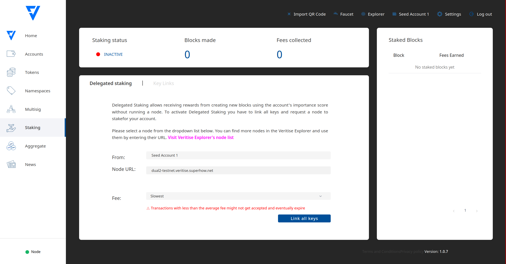
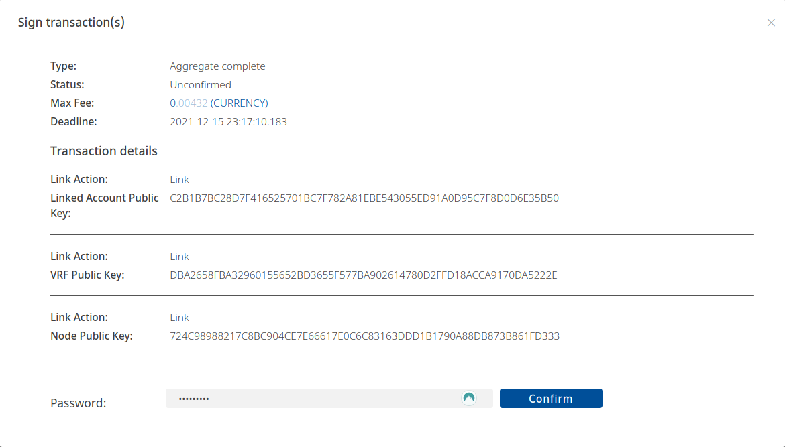
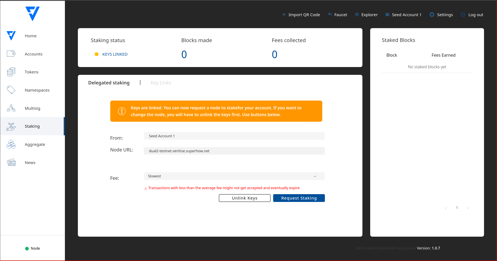
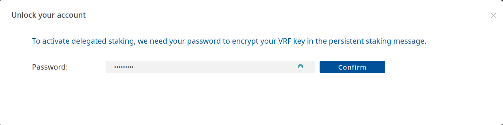
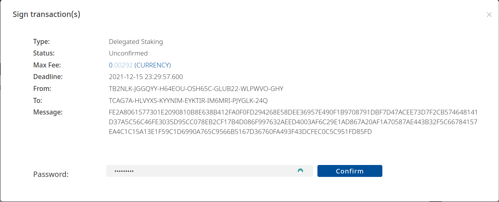



# Veritise Wallet v1.1.8

[](https://opensource.org/licenses/Apache-2.0)

> <b> Important: Veritise wallet compatable with 2022-02-15 snapshot</b>

Cross-platform client to manage accounts, tokens, namespaces, and issue transactions.
***
## Features
### Home 
Sending transfers and invoices, dashboard displaying previous transactions, list of assets, available balance – all in one place.
### Accounts 
Add or remove accounts and contacts, preview information such as account details (public and private keys, Metadata), or back up your profile as a paper wallet.
### Tokens
View your owned and expired tokens or create new ones, with the options to set the supply, divisibility, duration and fee.
### Namespaces
View your owned and expired namespaces or create new namespaces and sub-namespaces.
### Multisig
Modify account multisig properties by defining an account as a Multi-Signature Account, adding cosignatories and defining the minimum number of signatures required to sign a transaction, add a cosigner or remove a cosigner.
### Staking
Use the Importance score of an account to create new blocks and receive rewards without having to run a node locally.
### Aggregate
Aggregate several simple, token or namespace transactions to conveniently merge them into a single transaction.
### News
Get the latest cryptocurrency news and articles, conveniently displayed in the News section.
***


## Installation

Veritise Wallet is available for Mac, Windows, Linux, and as a web application.

1. Download Veritise Desktop Wallet from the releases section.

2. Launch the executable file and follow the installation instructions.

3. Create a profile. Remember to save the mnemonic somewhere safe (offline).
***

## Enabling Staking

 Share your account’s importance securely with a node and get rewarded.

### Introduction
Delegated staking enables accounts to receive rewards from creating new blocks without running a node. At the same time, it allows nodes to benefit from an account’s (possibly higher) importance score.

### Note

Node owners have access to the node’s configuration so it’s more convenient for them to use Remote staking instead.

It is thus much more convenient to use Veritise’s Desktop Wallet as shown in this guide.

The process requires little more than selecting the desired node and sending a staking request.

### Prerequisites
Before you can activate delegated staking using the  Veritise's Desktop Wallet, you need the following items:

1. An up-to-date Desktop Wallet. Download the latest version from the releases page.

2. An account that will receive the staking fees. It must have:

3. Minimum 10,000 veritise.currency token, maximum 100,000,000,  to be eligible and then some more to pay for transaction fees.

4. An importance score greater than zero. Keep in mind that this score is calculated every 3-4h.

### Guide
1. **Select the staking option in the menu on the left. You should see the staking screen:**




<em>Note: that the staking status is 🔴 INACTIVE.</em>

2. **Click on the “Node URL” box to see a list of nodes currently connected to the network.**

---
**NOTE**

<em>
Only nodes which act both as Peer and API nodes are shown on this list, but you can still request staking from pure Peer nodes by manually writing their URL in the box. In this case, though, you will also need to provide the node’s transport public key.

This key must be provided by the node owner. If you have instantiated the node using veritise-node, you can find this key in the addresses.yml file.

Keep in mind, though, that when delegating staking to a non-API node the staking Status indicator will not work.
</em>

---

3. **Select a node from the list and click on the “Link all keys” button** (You will probably need to scroll down past the “Keys Info” section).

 You will be asked to sign an Aggregate Transaction:



This aggregate transaction registers 3 different keys to your account which are needed for staking.

4. **Enter your password and click “Confirm”.**


The Desktop Wallet will then sign the transaction and announce it to the network. After a little while (shouldn’t take longer than 30 seconds), the screen should update:



You can see that the staking status has changed to 🟡 KEYS LINKED and the different keys appear in the form.

All that is left now is to send a Persistent Delegation Request Transaction which is the actual request to the node.

5. **Click on the “Request Staking” button.**

Your password is needed again to encrypt the persistent delegation message sent to the node:



6. **Enter your password and click “Confirm”.**

Your password is needed one last time to sign and announce the persistent delegation request:



7. **Enter your password and click “Confirm”** (again).

* Once you receive the confirmation message (shouldn’t take longer than 30 seconds), the staking status should change to 🟡 ACTIVATION IN PROGRESS

* At this point it is up to the node to accept the request and add your account as a staker. When this happens, the staking status will change to 🟢 ACTIVE

Delegated staking is now enabled and you should start collecting fees, at a rate proportional to your node’s importance score

---
**NOTE**


When requesting delegation through a Persistent Delegation Request Transaction instead of directly configuring the node, whether the node enables delegated staking depends entirely on the node and not on the network. It is entirely up to the node to comply with the request or even to lie about its state and provide a misleading staking status indicator.

Therefore, there is no reliable way to know if your account has become a staker or not besides waiting to see if your account starts receiving staking fees.


---


Status  | Meaning
------------- | -------------
🔴 INACTIVE  | Some keys are missing. Go to step 2.
🟡 KEYS LINKED  | Keys are present but the staking delegation request has not been sent. Go to step 5.
🟡 IN PROGRESS | The staking delegation request has been sent but the node has not acknowledged it yet. It might take a few minutes, or it might never happen. There is not much you can do at this point, except trying a different node.
🟢 ACTIVE | Staking is enabled. Staked blocks and their fees should start arriving, depending on your account’s importance.

---
**NOTE**


Accounts with higher importance are selected more often to perform staking. Even if you successfully register as a delegated staker with a node, you will not stake any block (nor receive any fees) unless your importance score is high enough.

Importance score calculation does not happen continuously. By default, account importance scores are recalculated every 720 blocks (about every 3-4 hours).

Finally, as explained in the note above, announcing a staking Delegation request does not guarantee being added as a delegated staker. Nodes are free to comply with the request or even to lie about its status.


---

## Building instructions (web version)

### Recomended

Ubuntu 18.04 TLS, 4Gb RAM

### Requirements

**Node.js 10 or 12 LTS** is required to run Veritise Wallet as a web application.
It is recommended to install **npm**, the Node.js package manager. This can be done by executing the following command:

```
sudo apt install npm
```
   
1. Install nvm:

```
wget -qO- https://raw.githubusercontent.com/nvm-sh/nvm/v0.38.0/install.sh | bash
```

2. Logout and login to your server

```
exit
```

3. Update npm

```
nvm install 12 tls
```
   
4. Check version   
   
```
node -v
```

### Wallet Installation Instructions

1. Clone the project.

```
git clone https://github.com/veritise/wallet.git
```

2. Navigate to the project folder.

```
cd wallet
```
	
3. Install the dependencies. This may take a while.

```
npm install 
```

4. Start the development server.

```
npm run dev 
```

5. Visit http://yourserverip:8080/#/ in your browser.

6. Build production package

```
npm run build 
```

7. Install apache

```
apt install apache2 
```

8. Move the compiled application to the webserver location

```
mv dist/* /var/www/html
```

***
## Feature status
### Features currently working

* Sending transactions                  ✔️
* Account and contact management        ✔️
* Exporting transactions                ✔️
* Multisig management                   ✔️
* Token creation                        ✔️
* Namespace creation                    ✔️
* News section                          ✔️
* Staking                               ✔️
* Profile Backup (PDF)                  ✔️
* Mnemonic Backup (PDF)                 ✔️
* QR Code Upload (Upload Image)         ✔️
* QR Code Import (Scan via Camera)      ✔️

***
## Main changes
* Changed news source (RSS channel) to cryptonews.com (https://cryptonews.com/news/feed) for more relevant news articles.
* Altered UI elements (colors, text, icons) for a more appealing, consistent and coherent appearance.
* Veritise-paper-wallets node module has been added to enhance the design of exported PDF paper wallet (when making a backup of accounts or mnemonic phrases). The templates of paper wallets are .PDF files, encoded in Base64 and stored in encodedBasePdf.js and encodedBasePrivateKeyPdf.js files in /modules/veritise-paper-wallets/resources.
***
### Known issues

* The process of starting Delegated Staking may be problematic, as there may be difficulties in linking the node, remote and vrf keys. Linking a key may appear to be ineffective, as the screen may not refresh after signing the linking transaction. In that case, logout and login again.

***
### Additional notes

* The RSS feed (cryptonews.com) is fetched using a CORS proxy (cors-bridged) if the project is deployed in the 'development' environment, and without a proxy if the project is in the 'production' environment. For the web version of the project, the news section normally may not show any fetched news due to CORS policy, thus the CORS proxy is applied.

***
# Troubleshooting & FAQ (Frequently Asked Questions)
### Q: Nothing happens after I press "Link All keys" in the Staking menu and sign the transaction. What do I do?
 A: Try logging out of your account, and login again. Alternatively, link each key manually.

### Q: Nothing happens once I link a node, remote or vrf key in the Staking menu. What do I do?
 A: The linking may take up to 30 seconds, and the screen should refresh afterwards. If that doesn't happen, try logging out of the account and logging in again.

### Q: The Staking status is stuck on "ACTIVATION IN PROGRESS". What do I do?
 A: Check if you have more than 200 of network currency and staking currency, and if your Importance is higher than 0. Otherwise, stop the staking process, relink all the keys and try starting the staking process again. If all else fails, try a different node.

### Q: There's an issue that's not documented in this section. What do I do?
 A: If you encounter an issue, please click the "See an issue?" button in the bottom right corner and fill in the details of the issue report.
***
